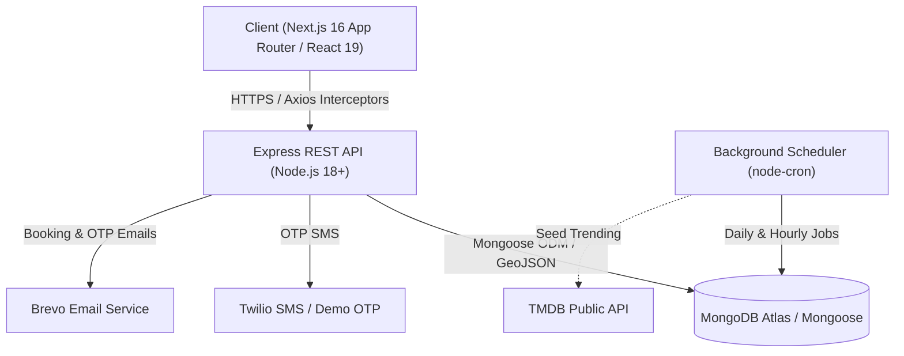

# 🏛️ CineBook — Architecture, Memory & Status Specification

> **Version**: 1.0.0  
> **Last Updated**: September 2026  
> **Target Audience**: Core Developers, System Architects, AI Engineering Agents

---

## 📑 Table of Contents
1. [Executive Summary](#1-executive-summary)
2. [High-Level Architecture & Tech Stack](#2-high-level-architecture--tech-stack)
3. [Project Memory & Domain Rules](#3-project-memory--domain-rules)
   - [3.1 Atomic Seat Locking & Reservation Engine](#31-atomic-seat-locking--reservation-engine)
   - [3.2 Autonomous Show Scheduling](#32-autonomous-show-scheduling)
   - [3.3 Geolocation & 39-City Fallback Mesh](#33-geolocation--39-city-fallback-mesh)
   - [3.4 Wallet, Ledger & Refund Mechanics](#34-wallet-ledger--refund-mechanics)
   - [3.5 QR Verification & PDF Ticket Pipeline](#35-qr-verification--pdf-ticket-pipeline)
4. [Database & Data Models](#4-database--data-models)
5. [API & Interface Contracts](#5-api--interface-contracts)
6. [Client-Side Architecture & UI/UX State](#6-client-side-architecture--uiux-state)
7. [System Status, Verification & Test Coverage](#7-system-status-verification--test-coverage)
8. [Configuration & Environment Registry](#8-configuration--environment-registry)

---

## 1. Executive Summary

**CineBook** is a full-stack, real-time movie ticket booking engine and theater management platform. Built with Next.js 16 (React 19) and Express on Node.js with MongoDB Atlas, the system provides high concurrency seat reservations, automated show schedule generation across 39 cities, digital wallet transactions with instant refunds, and multi-tier role-based access control.

---

## 2. High-Level Architecture & Tech Stack



### 2.1 Technology Stack Details

| Layer | Component | Version / Tools | Purpose / Highlights |
|---|---|---|---|
| **Frontend** | Framework | Next.js 16.2.3 (App Router) | High-performance React rendering, client-side routing |
| | Core Library | React 19.2.4 + TypeScript 5 | Typed component hierarchy, state hooks |
| | Styling | Vanilla CSS Modules | Glassmorphism, custom CSS variables, responsive design |
| | Icons | Lucide React | Clean, scalable interface iconography |
| | Ticketing & PDF | `jspdf` + `html2canvas` + `qrcode` | Client-rendered downloadable tickets with scannable QR |
| | Notifications | `react-hot-toast` | Non-blocking dark-themed toast notices |
| **Backend** | Runtime & Server | Node.js + Express 5.2.1 | Lightweight, high-throughput REST API |
| | Database | MongoDB Atlas + Mongoose 9.4.1 | Document storage, Geospatial 2dsphere indexes |
| | Security | JWT + BcryptJS + Rate Limiter | Stateless authentication, brute-force protection |
| | Task Scheduler | `node-cron` 4.2.1 | Autonomous 7-day rolling show generation |
| | Communications | Twilio + Nodemailer/Brevo | Multi-channel OTP and transaction notifications |
| | Asset Storage | Cloudinary | Secure user avatar storage |

---

## 3. Project Memory & Domain Rules

### 3.1 Atomic Seat Locking & Reservation Engine
- **Concurrency Problem**: Prevents double-booking when multiple users select identical seats simultaneously.
- **Lock Window**: Seats are temporarily held in `locked` state for **10 minutes** (`lockExpiresAt: Date.now() + 10 * 60 * 1000`).
- **Atomic MongoDB Updates**: Uses conditional Mongoose/Mongo operators (`findAndModify` / `findOneAndUpdate` with matching status `available`) to prevent race conditions.
- **Lock Cleanup**: Stale locks automatically clear either on-demand during show fetch or via background cron scheduler.
- **Seat Tiers**: 
  - `Platinum`: Premium front/middle rows (e.g., $350)
  - `Gold`: Standard middle rows (e.g., $250)
  - `Silver`: Value back/entry rows (e.g., $150)

### 3.2 Autonomous Show Scheduling
- **Target Reach**: 117+ theaters distributed across 39 major cities.
- **Rolling Window**: Cron jobs (`services/showScheduler.js`) ensure every theater has active screenings generated for the next **7 consecutive days**.
- **Timeslots**: Default slots generated daily: `10:00 AM`, `01:30 PM`, `05:00 PM`, and `08:30 PM`.
- **Deduplication**: Unique composite indexing (`theater + movie + date + time + screen`) prevents duplicate screenings.

### 3.3 Geolocation & 39-City Fallback Mesh
- **GPS Coordinates**: `LocationContext.tsx` queries the browser Geolocation API (`navigator.geolocation`).
- **Geospatial Proximity**: Server uses MongoDB `$nearSphere` on `2dsphere` indexes (`location.coordinates: [lng, lat]`).
- **Self-Healing Fallback**: When a user selects a city with missing theaters, `POST /api/theaters/ensure-city` automatically provisions standard cinemas and seeds shows on-demand.

### 3.4 Wallet, Ledger & Refund Mechanics
- **Internal Balance**: Stored in `User.wallet.balance`.
- **Double-Entry Ledger**: Stored in `User.wallet.transactions` recording `type` (`credit` | `debit`), `amount`, `description`, `referenceId`, and `timestamp`.
- **Cancellation Grace Period**: Bookings can be canceled within **10 minutes** of purchase before showtime, triggering an automatic 100% wallet credit refund.

### 3.5 QR Verification & PDF Ticket Pipeline
- **Cryptographic Identifier**: Each confirmed booking generates a unique `verificationCode` (stored in `Booking.qrCode`).
- **Public Scanner**: Cinema staff visit `/verify/[bookingId]` to scan the ticket QR and validate seat assignments and entry status.
- **Offline Proof**: Client generates vector-accurate PDF tickets with barcode, seats, show details, and QR using `jspdf` and `html2canvas`.

---

## 4. Database & Data Models

### 4.1 Schema Overview

```
User
├── name: String
├── email: String (Unique, Indexed)
├── phone: String (Indexed)
├── password: String (Hashed with bcrypt)
├── role: "user" | "admin"
├── isVerified: Boolean
└── wallet: { balance: Number, transactions: [TransactionSchema] }

Movie
├── title: String (Indexed)
├── description / synopsis: String
├── genre: [String]
├── duration: Number (minutes)
├── releaseDate: Date
├── posterUrl / backdropUrl: String
├── rating: Number
├── status: "now_showing" | "upcoming"
└── tmdbId: Number

Theater
├── name: String
├── city: String (Indexed)
├── location: { type: "Point", coordinates: [lng, lat] } (2dsphere Indexed)
├── totalScreens: Number
└── seatingCapacity: Number

Show
├── movie: ObjectId -> Movie
├── theater: ObjectId -> Theater
├── showDate: Date (Indexed)
├── showTime: String ("10:00 AM", etc.)
├── screen: Number
├── pricing: { silver: Number, gold: Number, platinum: Number }
└── seats: [[ { seatNumber: String, row: String, col: Number, tier: String, status: String, lockedBy: ObjectId, lockExpiresAt: Date } ]]

Booking
├── user: ObjectId -> User
├── show: ObjectId -> Show
├── seats: [String] ("A1", "A2", etc.)
├── totalAmount: Number
├── paymentMethod: "wallet" | "card" | "upi"
├── paymentStatus: "paid" | "refunded"
├── bookingStatus: "confirmed" | "cancelled"
└── qrCode: String
```

---

## 5. API & Interface Contracts

| Domain | Method | Endpoint | Access | Function |
|---|---|---|---|---|
| **Auth** | `POST` | `/api/auth/register` | Public | Register new user account |
| | `POST` | `/api/auth/verify-register-otp` | Public | Validate email/SMS registration OTP |
| | `POST` | `/api/auth/login` | Public | Authenticate via email/phone & password |
| | `POST` | `/api/auth/send-otp` | Public | Trigger SMS/Email OTP for passwordless login |
| | `POST` | `/api/auth/verify-otp` | Public | Exchange OTP for JWT session |
| | `GET` | `/api/auth/me` | User | Retrieve current user profile & wallet balance |
| **Movies** | `GET` | `/api/movies` | Public | Query movies (filters: genre, status, search, sort) |
| | `GET` | `/api/movies/:id` | Public | Get movie details & metadata |
| | `POST` | `/api/movies` | Admin | Create new movie entry |
| | `PUT` | `/api/movies/:id` | Admin | Update movie information |
| | `DELETE` | `/api/movies/:id` | Admin | Delete movie record |
| **Shows** | `GET` | `/api/movies/:movieId/shows` | Public | Get showtimes by movie, city, and date |
| | `GET` | `/api/shows/:id` | Public | Get show seat map layout & real-time availability |
| | `GET` | `/api/shows/theater/:theaterId` | Public | Get all shows for a cinema |
| **Bookings** | `POST` | `/api/bookings/lock` | User | Acquire 10-minute hold on selected seats |
| | `POST` | `/api/bookings/unlock` | User | Release held seats |
| | `POST` | `/api/bookings` | User | Finalize payment & confirm booking |
| | `GET` | `/api/bookings/my` | User | Retrieve user booking history |
| | `PUT` | `/api/bookings/:id/cancel` | User | Cancel reservation within 10-min window & refund |
| | `GET` | `/api/bookings/verify/:bookingId` | Public | Verify ticket authenticity via QR code |
| **Theaters** | `GET` | `/api/theaters/nearby` | Public | Geospatial search for nearby cinemas |
| | `POST` | `/api/theaters/ensure-city` | Public | Ensure city has provisioned theaters & shows |
| **Wallet** | `GET` | `/api/wallet` | User | Fetch balance & transaction statement |
| | `POST` | `/api/wallet/topup` | User | Add funds to digital wallet |
| **Admin** | `GET` | `/api/admin/dashboard` | Admin | Aggregate revenue, booking volume & user stats |
| | `GET` | `/api/admin/users` | Admin | Manage users and escalate roles |

---

## 6. Client-Side Architecture & UI/UX State

### 6.1 Routing Map

```
client/src/app/
├── page.tsx                           # Home (Hero Carousel, Now Showing, Upcoming)
├── layout.tsx                         # Global Providers & Header
├── movies/
│   ├── page.tsx                       # Movie Catalog & Search / Genre Filter
│   └── [id]/page.tsx                  # Movie Details & Showtimes by Theater
├── booking/
│   └── [showId]/page.tsx              # Interactive Seat Grid & Checkout Modal
├── cinemas/
│   ├── page.tsx                       # Cinemas Directory
│   └── [id]/page.tsx                  # Theater Showtimes
├── theaters-near-me/page.tsx          # Geolocation Nearby Cinema Finder
├── profile/
│   ├── page.tsx                       # User Dashboard, Wallet & Transactions
│   └── bookings/[bookingId]/page.tsx  # Dynamic Ticket View & PDF Downloader
├── verify/[bookingId]/page.tsx        # Gate Verification / QR Validator
├── admin/
│   ├── page.tsx                       # Admin Management Hub
│   └── login/page.tsx                 # Isolated Admin Login
└── auth/
    ├── login/page.tsx                 # Email / Phone OTP Login
    ├── register/page.tsx              # User Registration
    └── forgot-password/page.tsx       # Password Reset Flow
```

---

## 7. Security Architecture (5-Layer Defense)

Following the **Secure Vibe Coding** standards:

1. **Layer 1: Server-Side Validation & NoSQL Injection Protection**:
   - Express 5-compatible NoSQL sanitizer recursively strips `$`, `.` operator keys from all untrusted incoming payloads (`req.body` and `req.params`).
   - Server-side type, format, and boundary checks for wallet amounts, booking seats, and registration fields.
2. **Layer 2: Multi-Tiered Rate Limiting**:
   - Global API limit: 1000 requests per 15 minutes per IP.
   - Login brute-force defense: rate limited to prevent automated credential stuffing.
   - OTP generation: Rate limited per IP/endpoint to prevent SMS/Email abuse.
3. **Layer 3: Password Hashing & Secret Protection**:
   - `bcryptjs` with 12 salt rounds for all user credentials.
   - Passwords and OTP codes are set with `{ select: false }` in Mongoose schema to prevent accidental serialization.
4. **Layer 4: Zero-Information-Leakage Error Handling**:
   - Generic authentication messages (`"Invalid credentials"`) to block account/email enumeration.
   - Global exception handling masks internal stack traces and database errors in responses.
5. **Layer 5: HTTP Security Headers & Access Control**:
   - **Helmet**: Injects `Content-Security-Policy`, `X-Frame-Options: SAMEORIGIN`, `X-Content-Type-Options: nosniff`, and `Strict-Transport-Security`.
   - Strict resource ownership verification (`req.user._id`) on bookings, wallet transactions, and admin privilege gates.

---

## 8. System Status, Verification & Test Coverage

### 7.1 Component Status Registry

| Component | Path | Operational Status | Notes |
|---|---|---|---|
| **API Server** | `server/src/index.js` | 🟢 Operational | Express connected to MongoDB Atlas, CORS & preflight enabled |
| **Email Service** | `server/src/controllers/authController.js` | 🟢 Operational | Brevo API verified & sending live OTPs / confirmations |
| **Scheduler** | `server/src/services/showScheduler.js` | 🟢 Operational | Automated 7-day rolling show generation running |
| **City Seeder** | `server/src/services/citySeeder.js` | 🟢 Operational | 39 Cities verified with provisioned theaters |
| **Seat Locker** | `server/src/controllers/bookingController.js` | 🟢 Operational | 10-minute atomic locks with auto-expiry |
| **Frontend Client**| `client/src/app` | 🟢 Operational | Next.js 16 + React 19 dev server on port 3000 |
| **PDF Ticketing** | `client/src/app/profile/bookings` | 🟢 Operational | Dynamic PDF export with validation QR |
| **Admin Portal** | `client/src/app/admin` | 🟢 Operational | Dashboard metrics, theater & movie CRUD |

### 7.2 Automated Test Suite
- **Location**: `server/full_test_suite.js` & `server/test_suite.js`
- **Current Status**: **20/20 Core Test Assertions Passing (100% Pass Rate)**
- **Coverage Areas**:
  - Security headers (`helmet`, `nosniff`, `x-frame-options`, NoSQL injection prevention)
  - Direct password login (Option 1) with instantaneous JWT issuance
  - Account registration with 5-minute OTP verification & resend timer
  - Dedicated Resend Endpoints (`/resend-register-otp`)
  - Forgot password flow & OTP-based password reset
  - Movie catalog integrity, individual movie metadata & showtimes
  - Seat locking concurrency & simultaneous conflict resolution
  - Atomic booking confirmation, digital ticket issuance & seat status transition
  - Multi-device responsive CSS verification across Smartphones, Tablets, and Desktops

---

## 8. Configuration & Environment Registry

### Backend (`server/.env`)
```ini
PORT=5000
NODE_ENV=development
MONGO_URI=mongodb+srv://<user>:<password>@cluster0.xxxxx.mongodb.net/cinebook?retryWrites=true&w=majority
JWT_SECRET=super_secret_jwt_key
JWT_EXPIRE=7d
CLIENT_URL=http://localhost:3000
ALLOWED_ORIGINS=http://localhost:3000,http://localhost:3001,http://localhost:3002
ADMIN_PASSWORD=admin123
BREVO_API_KEY=xkeysib-your_brevo_api_key
EMAIL_USER=your_verified_sender@gmail.com
```

### Frontend (`client/.env.local`)
```ini
NEXT_PUBLIC_API_URL=http://localhost:5000/api
NEXT_PUBLIC_APP_URL=http://localhost:3000
```

---

*CineBook Architectural & Memory Specification — Maintained for AI Agents & Engineering Teams.*
