# 🎟 CineBook — Cancellation, Refund & Email Architecture Specification
## *Service Layer Abstraction, Atomicity, and Consistency (ACID) Deep Dive*

---

## 📌 1. Executive Overview

In a mission-critical online ticketing platform like **CineBook**, cancelling a booking and issuing a refund is not merely a database flag update. It represents a multi-domain transaction involving:
1. **State Transition**: Shifting the booking lifecycle state from `confirmed` to `cancelled` and `refunded`.
2. **Inventory Release**: Restoring held theater seats to the global pool in real-time.
3. **Financial Ledgering**: Atomically crediting the user's digital wallet and creating an immutable ledger transaction.
4. **Customer Communication**: Dispatching an asynchronous, beautifully formatted email receipt with refund details and updated wallet balance without blocking or compromising database operations.

```
┌─────────────────────────────────────────────────────────────────────────────────────────────┐
│                                 CINEBOOK TRANSACTION BOUNDARY                               │
├───────────────────┬───────────────────────────┬──────────────────────┬──────────────────────┤
│  Booking State    │    Theater Seat Map       │    Wallet Ledger     │    Email Dispatch    │
│  (Atomic CAS)     │   (Single Query Release)  │    (Atomic $inc)     │   (Non-blocking BG)  │
│                   │                           │                      │                      │
│   confirmed ──►   │    Row C: [4, 5] ──►      │   Balance + ₹480     │   Brevo / SMTP       │
│    cancelled      │       AVAILABLE           │  Ledger Audit Entry  │   Refund Voucher     │
└───────────────────┴───────────────────────────┴──────────────────────┴──────────────────────┘
```

---

## 🏗 2. Architecture & Service Layer Abstraction

### 2.1 The Problem with Ad-Hoc Implementations
Directly embedding raw network calls (e.g. `fetch('https://api.brevo.com/...')`) and database mutations inside HTTP route handlers causes:
* **Coupling**: Tight dependency on external email vendor APIs.
* **Code Duplication**: Repetitive transporter configs across `authController`, `bookingController`, and `adminController`.
* **Fragility**: Unhandled network timeouts in third-party APIs can crash or roll back valid financial refunds.

### 2.2 Centralized Service Layer (`emailService.js`)
We establish a dedicated **Email Service Abstraction** that encapsulates provider orchestration, failover chains, and HTML template generation.

```
                  ┌──────────────────────────────────────────────┐
                  │            Client / API Request              │
                  └──────────────────────┬───────────────────────┘
                                         │
                                         ▼
                  ┌──────────────────────────────────────────────┐
                  │              Booking Controller              │
                  │   - Atomic Status Change (CAS)               │
                  │   - Atomic Wallet Refund ($inc)              │
                  │   - Atomic Seat Release                      │
                  └──────────────────────┬───────────────────────┘
                                         │
                                         ▼
                  ┌──────────────────────────────────────────────┐
                  │             Email Service Facade             │
                  │       (server/src/services/emailService.js)  │
                  └──────┬───────────────┬───────────────┬───────┘
                         │               │               │
            ┌────────────┴──┐     ┌──────┴────────┐      └──────────────┐
            ▼               │     ▼               │                     ▼
   ┌─────────────────┐      │ ┌───────────────┐   │          ┌──────────────────────┐
   │ Primary Provider│      │ │ Fallback SMTP │   │          │ Mock / Dev Provider  │
   │   (Brevo REST)  │◄─────┘ │(Gmail/Nodemail│◄──┘          │   (Console Logger)   │
   └─────────────────┘        └───────────────┘              └──────────────────────┘
```

### 2.3 Provider Failover Chain
1. **Primary**: **Brevo (Sendinblue) REST API v3** — High-speed HTTP endpoint bypassing SMTP port blocks on serverless/container hosts.
2. **Secondary**: **Nodemailer SMTP (Gmail)** — Traditional transport fallback if Brevo encounters API key limits or whitelisting issues.
3. **Tertiary**: **Structured Audit Logger** — Captures email payloads locally in development without throwing fatal runtime errors.

---

## ⚛ 3. Atomicity & Concurrency Control (ACID)

In high-concurrency environments (e.g., flash ticket sales or duplicate browser clicks), race conditions can cause **Double-Refund Attacks** or **Ghost Inventory Holds**. CineBook eliminates this via strict MongoDB atomic patterns.

### 3.1 Compare-And-Swap (CAS) State Transition
Instead of a vulnerable `findById()` followed by `save()`, cancellation uses a single **Atomic CAS** query:

```javascript
// ATOMIC STATE GUARD: Only a booking currently in 'confirmed' state can be cancelled
const booking = await Booking.findOneAndUpdate(
  {
    _id: bookingId,
    user: userId,
    status: 'confirmed',           // <--- Atomic Predicate
    paymentStatus: 'paid'
  },
  {
    $set: {
      status: 'cancelled',
      paymentStatus: 'refunded',
      cancelledAt: new Date()
    }
  },
  { new: false } // Returns the pre-update document
);

if (!booking) {
  // Either not found, unauthorized, or ALREADY CANCELLED
  return res.status(400).json({ 
    success: false, 
    message: 'Booking cannot be cancelled (already cancelled, used, or expired).' 
  });
}
```

> **Invariant Guaranteed**: If 10 concurrent HTTP cancellation requests arrive simultaneously for the same `bookingId`, **exactly ONE** update query modifies the document (`modifiedCount === 1`). The other 9 requests return `null` and terminate immediately without refunding money or double-decrementing stats.

---

### 3.2 Atomic Wallet Credit (`refundWallet`)
Wallet balance updates and ledger entries are executed in a single atomic database operation:

```javascript
exports.refundWallet = async (userId, amount, description) => {
  const updatedUser = await User.findOneAndUpdate(
    { _id: userId },
    {
      $inc: { walletBalance: amount },
      $push: {
        walletTransactions: {
          type: 'credit',
          amount: amount,
          description: description,
          date: new Date()
        }
      }
    },
    { new: true, select: 'walletBalance' }
  );

  return updatedUser ? updatedUser.walletBalance : 0;
};
```

---

### 3.3 Atomic Bulk Seat Release
All seats associated with the cancelled booking are unlocked in one atomic filter query:

```javascript
await Show.updateOne(
  { _id: booking.show },
  {
    $set: {
      'seats.$[elem].userId': null,
      'seats.$[elem].bookingId': null,
      'seats.$[elem].lockedBy': null,
      'seats.$[elem].lockedUntil': null,
    }
  },
  {
    arrayFilters: [
      { 'elem.bookingId': booking._id } // Matches all seats belonging to this booking
    ]
  }
);
```

---

## ⚖ 4. Consistency Guarantees & Ledger Invariants

| Domain | Invariant Rule | Enforcement Mechanism |
| :--- | :--- | :--- |
| **Financial Ledger** | `user.walletBalance == Σ(credits) - Σ(debits)` | Atomic `$inc` and `$push` on every wallet transaction. |
| **Inventory State** | A seat can never be double-booked or orphaned. | Seat release clears `bookingId` and `userId` directly tied to `booking._id`. |
| **Movie Analytics** | `movie.totalBookings` reflects actual active seats. | Atomic `$inc: { totalBookings: -booking.seats.length }`. |
| **Idempotency** | Cancellation endpoint is strictly idempotent. | CAS status check (`status === 'confirmed'`). |
| **Fault Isolation** | Email failures do not corrupt financial ledger. | Asynchronous `try/catch` wrapper around `emailService` dispatch. |

---

## 📧 5. Email Notification Template & Specification

When a cancellation and refund succeeds, the system compiles a responsive, dark-mode themed HTML email.

### 5.1 Email Visual Layout Wireframe
```
+-----------------------------------------------------------+
|                      🎬 CINEBOOK                          |
+-----------------------------------------------------------+
|                                                           |
|   [!] Booking Cancelled & Refund Processed                |
|   Your cancellation request has been completed.           |
|                                                           |
|   +---------------------------------------------------+   |
|   |  🎬 Interstellar (IMAX 3D)                        |   |
|   |  📍 CineBook IMAX Cinemas, Mumbai                 |   |
|   |  📅 Sat, 14 Sep 2026  |  🕐 07:30 PM              |   |
|   |  💺 Seats: Gold Tier - C4, C5                      |   |
|   |  🎫 Booking ID: CB-9823471                        |   |
|   +---------------------------------------------------+   |
|                                                           |
|   +---------------------------------------------------+   |
|   |  ✅ ₹480.00 Refunded to CineBook Wallet           |   |
|   |  Updated Wallet Balance: ₹1,240.00                |   |
|   |  Available instantly for your next movie booking. |   |
|   +---------------------------------------------------+   |
|                                                           |
|   Need help? Contact support@cinebook.com                 |
+-----------------------------------------------------------+
```

### 5.2 Email Notification Parameters Schema
```typescript
interface CancellationRefundEmailPayload {
  to: string;                 // User email address
  userName: string;           // Customer full name
  bookingId: string;          // Human-readable Booking Reference (e.g. CB-94812)
  movieTitle: string;         // Movie title
  moviePoster?: string;       // Poster image URL
  theaterName: string;        // Cinema / Multiplex name
  theaterCity: string;        // Location city
  showDate: string;           // Formatted date string (e.g. "Sat, 14 Sep 2026")
  showTime: string;           // Showtime string (e.g. "07:30 PM")
  seatLabels: string[];       // Array of seat coordinates (e.g. ["C4", "C5"])
  refundAmount: number;       // Exact refund credited (e.g. 480)
  updatedWalletBalance: number; // New total wallet balance (e.g. 1240)
}
```

---

## 🔄 6. End-to-End Sequence Diagram

```mermaid
sequenceDiagram
    autonumber
    actor User as 👤 Customer
    participant Client as 💻 Next.js Frontend
    participant API as 🛡 Booking Controller
    participant DB as 🗄 MongoDB Atlas
    participant Wallet as 💳 Wallet Engine
    participant Email as 📧 Email Service

    User->>Client: Click "Cancel Booking"
    Client->>API: PUT /api/bookings/:id/cancel
    
    rect rgb(20, 25, 40)
        Note over API,DB: ATOMIC TRANSACTION PHASE
        API->>DB: findOneAndUpdate({ _id, user, status: 'confirmed' }) -> 'cancelled'
        alt Booking already cancelled or invalid
            DB-->>API: null
            API-->>Client: 400 Bad Request (Already Cancelled)
        else CAS Succeeded
            DB-->>API: Confirmed Booking Document
            API->>DB: Show.updateOne (Release seats by bookingId)
            API->>DB: Movie.updateOne ($inc: totalBookings -seats.length)
            API->>Wallet: refundWallet(userId, totalAmount)
            Wallet->>DB: User.findOneAndUpdate ($inc: walletBalance, $push: transaction)
            DB-->>Wallet: updatedBalance
            Wallet-->>API: updatedBalance
        end
    end

    rect rgb(25, 40, 25)
        Note over API,Email: ASYNC NOTIFICATION PHASE (Non-blocking)
        API->>Email: sendCancellationRefundEmail({ booking, refundAmount, updatedBalance })
        API-->>Client: 200 OK { success: true, refunded: totalAmount, balance: updatedBalance }
        Email->>User: 📩 Deliver Refund Receipt & Updated Balance Email
    end
```



---

## 🛠 7. Implementation Blueprint Reference

### 7.1 `server/src/services/emailService.js` Specification
```javascript
const nodemailer = require('nodemailer');

class EmailService {
  constructor() {
    this.sender = {
      name: 'CineBook',
      email: process.env.EMAIL_USER || 'noreply@cinebook.com'
    };
  }

  async sendEmail({ to, subject, htmlContent }) {
    // 1. Try Brevo HTTP REST API
    if (process.env.BREVO_API_KEY && !process.env.BREVO_API_KEY.startsWith('your_')) {
      try {
        const res = await fetch('https://api.brevo.com/v3/smtp/email', {
          method: 'POST',
          headers: {
            'accept': 'application/json',
            'api-key': process.env.BREVO_API_KEY,
            'content-type': 'application/json',
          },
          body: JSON.stringify({
            sender: this.sender,
            to: [{ email: to }],
            subject,
            htmlContent,
          }),
        });
        if (res.ok) return { success: true, provider: 'brevo' };
      } catch (err) {
        console.warn('[EmailService] Brevo failed, trying SMTP:', err.message);
      }
    }

    // 2. Fallback to Nodemailer SMTP
    if (process.env.EMAIL_USER && process.env.EMAIL_PASS) {
      try {
        const transporter = nodemailer.createTransport({
          host: 'smtp.gmail.com',
          port: 587,
          secure: false,
          auth: { user: process.env.EMAIL_USER, pass: process.env.EMAIL_PASS },
        });
        await transporter.sendMail({
          from: `"${this.sender.name}" <${this.sender.email}>`,
          to,
          subject,
          html: htmlContent,
        });
        return { success: true, provider: 'smtp' };
      } catch (smtpErr) {
        console.warn('[EmailService] SMTP fallback failed:', smtpErr.message);
      }
    }

    // 3. Fallback to Local Console Logger
    console.log(`[EmailService:Mock] To: ${to} | Subject: ${subject}`);
    return { success: true, provider: 'mock' };
  }

  async sendCancellationRefundEmail({ user, booking, show, theater, movie, refundAmount, updatedBalance }) {
    const seatList = booking.seats.map(s => `${String.fromCharCode(65 + s.row)}${s.col + 1}`).join(', ');
    const showDate = show?.date ? new Date(show.date).toLocaleDateString('en-IN', {
      weekday: 'short', day: 'numeric', month: 'short', year: 'numeric'
    }) : '';

    const htmlContent = `
      <div style="font-family: -apple-system, BlinkMacSystemFont, 'Segoe UI', Roboto, sans-serif; max-width: 540px; margin: 0 auto; background: #0a0a0f; color: #ffffff; padding: 32px; border-radius: 16px; border: 1px solid #222;">
        <div style="text-align: center; margin-bottom: 24px;">
          <h1 style="color: #e50914; margin: 0; font-size: 26px; font-weight: 800; letter-spacing: 1px;">🎬 CINEBOOK</h1>
          <p style="color: #888; font-size: 13px; margin-top: 4px;">Ticket Cancellation & Refund Receipt</p>
        </div>

        <div style="background: #14141e; border: 1px solid #28283c; border-radius: 12px; padding: 20px; margin-bottom: 20px;">
          <h2 style="color: #fff; margin: 0 0 12px 0; font-size: 18px;">${movie?.title || 'Movie'}</h2>
          <table style="width: 100%; border-collapse: collapse; font-size: 14px; color: #bbb;">
            <tr><td style="padding: 4px 0;">📍 Cinema:</td><td style="color: #fff; text-align: right; font-weight: 600;">${theater?.name || 'CineBook Multiplex'}, ${theater?.city || ''}</td></tr>
            <tr><td style="padding: 4px 0;">📅 Date & Time:</td><td style="color: #fff; text-align: right; font-weight: 600;">${showDate} • ${show?.time || ''}</td></tr>
            <tr><td style="padding: 4px 0;">💺 Seats:</td><td style="color: #fff; text-align: right; font-weight: 600;">${seatList}</td></tr>
            <tr><td style="padding: 4px 0;">🎫 Booking Ref:</td><td style="color: #aaa; text-align: right; font-family: monospace;">${booking.bookingId}</td></tr>
          </table>
        </div>

        <div style="background: rgba(34, 197, 94, 0.1); border: 1px solid #22c55e; border-radius: 12px; padding: 20px; margin-bottom: 24px; text-align: center;">
          <p style="margin: 0; color: #22c55e; font-size: 18px; font-weight: 800;">₹${refundAmount.toFixed(2)} Refund Credited</p>
          <p style="margin: 8px 0 0 0; color: #ddd; font-size: 14px;">Updated CineBook Wallet Balance: <strong style="color: #fff;">₹${updatedBalance.toFixed(2)}</strong></p>
          <p style="margin: 6px 0 0 0; color: #888; font-size: 12px;">Instant credit — ready for your next booking.</p>
        </div>

        <p style="color: #555; font-size: 11px; text-align: center; margin: 0;">
          If you did not initiate this cancellation, please contact CineBook Security immediately.
        </p>
      </div>
    `;

    return this.sendEmail({
      to: user.email,
      subject: `🎬 Refund Confirmed — ₹${refundAmount} credited for ${movie?.title || 'Booking'}`,
      htmlContent
    });
  }
}

module.exports = new EmailService();
```

---

## 🧪 8. Test & Verification Matrix

| Test ID | Test Case | Expected Assertion |
| :--- | :--- | :--- |
| **T1** | Valid Cancellation within 10-min window | Booking status becomes `cancelled`, seats freed, wallet credited, `200 OK`. |
| **T2** | Double Cancellation (Idempotency) | 2nd call returns `400 Bad Request`, wallet is NOT credited a second time. |
| **T3** | Expired Cancellation (> 10 mins) | Rejects with `400 Bad Request ("Cancellation window has expired")`. |
| **T4** | Concurrent Cancellation (5 threads) | Exactly 1 success (`200 OK`), 4 rejections (`400 Bad Request`), exactly 1 wallet credit. |
| **T5** | Email Dispatch Isolation | If email API returns `500 Server Error`, cancellation transaction still commits `200 OK`. |

---
*© 2026 CineBook Architecture Engineering Group. All rights reserved.*
